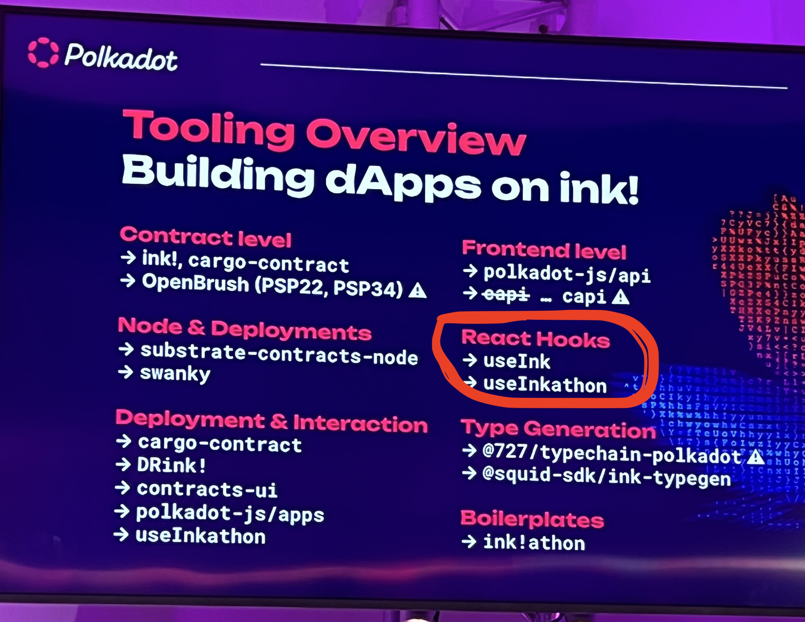

# useink

* **Team Name:** Veracity Consulting, LLC (Sam Ruberti, Alan Chao)
* **Payment Address:** WithVeracity.eth (0x8AF47A5515f57b16C9b97619d510af233342e598)

## Project Overview :page_facing_up:

Frontend application development for Polkadot SDK and ink! presents significant challenges. PolkadotJS is the go-to library for building dApps at the moment, but its primary purpose is to provide low-level primitives for library builders rather than serving as a framework for rapid development. It entails the installation of over ten packages and extensive configuration for even simple tasks. Furthermore, some parts of the contract-pallet JS API are not functioning correctly, and the documentation is outdated. DApp developers should not have to repetitively construct frameworks and piece together more than ten JavaScript packages. An opinionated framework is needed, and ink! should offer a comprehensive toolkit if it wants to see growth.

useink ([repository](https://github.com/paritytech/useink/) and [documentation](https://use.ink/frontend/overview)) is an opinionated JavaScript framework with React support, created by Sam Ruberti during his tenure on the ink! team at Parity. It simplifies dApp development, making it fast, straightforward, and ergonomic. useink abstracts away the complexities of PolkadotJS and incorporates design patterns refined and honed over seven years in the Web3 space, and learned from other libraries such as [useDApp](https://usedapp.io/) and [Wagmi](https://wagmi.sh/) for EVM. It is a single JavaScript package that significantly reduces boilerplate code. Now, tasks that used to require hundreds of lines of code with PolkadotJS can be accomplished in a single line using useink. It distinguishes itself in the ecosystem by providing user-friendly tools. These include simultaneous multi-chain connections within a single view, support for 297 production and testnet configurations with typed chain ID names, wallet extension APIs, data decoding compatible with WeightsV2 (a feature that broke in PolkadotJS after the WeightsV2 release), ergonomic helper functions, and robust typing throughout. useink ensures that all message call results come from the same block to maintain data parity. Additionally, it offers subscription calls for contracts, a feature currently unavailable through PolkadotJS. In essence, useink addresses a critical gap in the Polkadot SDK and ink! dApp development stack.

This grant request seeks support for the ongoing development of useink and the release of version 2.0, promising an enhanced dApp development experience.

*NOTE: Dennis Zoma, the creator of useInkathon and co-founder of Scio Labs, has suggested merging [useInkathon](https://github.com/scio-labs/use-inkathon) into useink. This aligns with Scio Labs' plan to help unify community effort and utilize useink in [ink!athon](https://inkathon.xyz/), an awesome React boilerplate for ink! dApps [that was presented at Sub0 2023](https://www.youtube.com/watch?v=SoNLZfsd0mQ).*

#### Origins of useink

The most valuable libraries are those designed for real-world applications, rather than just "hello world" (or "flipper") scenarios. useink was born out of the practical needs and boilerplate code of numerous dApps. Its API has evolved based on genuine product requirements and user experience considerations, not abstract theories developed in isolation.

This is precisely why every React hook within useink exposes a `resetState()` function. This function empowers developers to effortlessly clear errors when a user modifies an input field. Additionally, it's the reason behind the existence of the `PendingSignature` state for transactions when `signAndSend()` is initially invoked. This state allows developers to display a message prompting the user to sign a message with their wallet extension and disable a form accordingly.

We've even taken care to provide enum errors for situations where a user rejects a transaction within their wallet. These may seem like small details, but they collectively enhance the developer experience, improve user interactions, and contribute to a library that is genuinely production-ready. We hope that this library fosters community growth and better user experiences with Web3 applications.

### Project Details

Veracity is applying for a grant to continue working on useink v1.14.1 and launch version 2.0. Here is a list of the features we've collected from community feedback, Dennis Zoma's suggestions, and Sam's vision.

#### New Features:
* Light Clients as Default:
    * Option to select `trusted` or `light` on a per-chain basis for multi-chain connections.
    * API for developers to create a user-friendly UI so a user can choose the connection type: `setClient('trusted', 'astar')` and `setClient('light', 'aleph')`.

* Merge useInkathon Features:
    * Consolidate [useInkathon](https://github.com/scio-labs/use-inkathon) features into useink, fostering a unified community effort.

* Configurable Fallback RPC URLs:
    * Use configurable fallback RPC URLs in case of node failures or timeouts.

* Reduced Dependency on `pick*` Helpers:
    * Eliminate the need for most of the [pick* helpers](https://use.ink/frontend/utils/pick) in `useink/utils` by adding message results directly to the object.

* Enhanced useink/core for Non-React Apps:
    * Expand the functionality of the useink/core package to cater to non-React applications.

* Streamlined Handling of Events:
    * Research and develop an easier way to handle and decode events emitted by pallets and contracts.

* Additional React Hooks:
    * Add React hooks for Polkadot SDK pallets (e.g., balances, staking) and PSP standards.

* Efficient Contract Registration:
    * Introduce tools to register a contract in the global React context for seamless accessibility in React child components.

* Improved Event Filtering:
    * Create a user-friendly method to filter past events emitted from a contract, making event-related tooling more accessible.

* Wallet Integration Enhancement:
    Replace `talisman-connect-wallet` with plain JavaScript, adding support for all wallets, including Aleph Zero Wallet and Nova.

* Contract Metadata Optimization:
    * Develop a script to optimize contract metadata file sizes for faster loading times in production frontend builds.

* Dynamic Hook Generation:
    * Dynamically generate hooks from contract metadata to enhance usability.

* Type Generation from Contract Metadata:
    * Create a tool to generate types from contract metadata that align with idiomatic useink practices, potentially introducing a new package called "Typewriter."

#### Improvements:

* Dynamic Chain Configuration:
    * Remove hard-coded chain configuration values, allowing dynamic lookup via the API Registry, including chain token decimals, symbols, etc.

* Enhanced Chain Configuration Defaults:
    * Ensure all chain configurations have at least one RPC URL, enabling them to work seamlessly out of the box.

* Fix `useTransfer()` hook:
    * Address underlying issues in `useTransfer()` that are currently broken in PolkadotJS.

* Refine `useBalance()` hook:
    * Provide a more accurate representation of "free" balances, accounting for staked funds.

#### New Learning Resources:

* Expanded Front-End Examples:
    * Add more front-end examples to the [ink-examples repository](https://github.com/paritytech/ink-examples/).

* Demonstrate Common Patterns:
    * Showcase common contract/frontend patterns, such as handling successful transactions and errors, using useink's ergonomic features.

* YouTube Tutorial Series:
    * Develop a YouTube series covering frontend development with useink, including getting started, building a full stack dApp with useink before Polkadot SDK can compile, and demonstrating full stack dApp patterns.

* Docusaurus Documentation:
    * Document all the above features and resources in Docusaurus, providing comprehensive developer guidance.

### Ecosystem Fit

useInk serves as a bridge between "low-level" libraries like PolkadotJS and end-user applications. (Please note that useInkathon will be merged into useInk and eventually phased out.)

## Team :busts_in_silhouette:

### Team members

* Sam Ruberti
* Alan Chao

### Contact

* **Contact Name:** Sam Ruberti
* **Contact Email:** sam@veracity.fi

### Legal Structure

* Incorporated in Miami, Florida, USA.
* Address: (Details submitted via Google Form)

### Team's experience

Each of us brings more than thirteen years of experience in building full-stack applications for both clients and startups. We've been utilizing React since its beta release and have been working with JavaScript for many years prior to that.

* [Parity](https://www.parity.io/) - Sam was "Senior Rust Core Developer" at Parity. He created [useink](https://use.ink/frontend/overview/) and built many dApps including [ink! Splash](https://github.com/paritytech/ink-workshop/) and the frontend examples in [ink-examples](https://github.com/paritytech/ink-examples/pull/37).

* Polkadot Blockchain Academy (Cambridge) - Sam graduated in the first cohort.

* [MODA](https://www.moda.audio/) is a web3 organization focused on registering music fingerprints on the blockchain and facilitating artist-fan interactions. Veracity built the complete technology stack, encompassing NFT and staking contracts using Solidity and React, and launched it on the Ethereum Mainnet. MODA's collaboration extended to some prominent electronic music artists, including deadmau5 and Kaskade. We are excited to announce that we will be launching a new MODA product on the Polygon network soon.

* PIPS ([New website](https://www.pipcards.com) / [Old website)](https://www.pips.cards/)) is an NFT playing card project built with Solidity and React, and was launched on both Moonriver and the Ethereum Mainnet. Each NFT comprises assets for an entire deck of cards. Each deck's DNA is generated on-chain from a unique seed to ensure a fair distribution of rarity, preventing any manipulation by team members. The project boasts over 250,000 distinct vector image playing cards, all generated using a custom off-chain rendering engine developed in TypeScript.

* Kusama Validator - Veracity was previously a participant of the 1000 validator program and made contributions to the [polkadot-secure-validator](https://github.com/with-veracity/polkadot-secure-validator/pull/1/files) repo, which is now deprecated.

* Solvana (Dashboard App requires invitation) - Sam is co-founder and CTO of Solvana, an e-commerce application for buying solar online. It is built with NodeJS, React, and many micro Lambdas. This project uses many custom package libraries for modeling system production, finacial incentives, and to track the  multiple stages of our turn key installation service.

* [Peloton](https://www.Peloton.com/) - Veracity helped launch the e-commerce app for Australia, and maintained the ones in the U.K., Germany, and the US. The tech stack consists of TyepScript, React, Kotlin, and Python.

* (Web2) [Clear](https://www.clearme.com/) is a prominent biometric identity company widely recognized at airports throughout the United States. We undertook the task of implementing a feature to systematically erase user data across more than 50 microservices. This process was accomplished by harnessing the power of Kafka and coordinating with multiple databases. Additionally, we developed an in-house React front-end application to seamlessly interact with the backend tooling built with Java and Kotlin.

* Fanum - Alan was co-founder and CTO of a music tastmaker social app called Fanum. He built everything including the API (Ruby on Rails), web application (React), the iOS app (Swift), and the Android app (Kotlin).

* [Bloomberg](https://pro.bloomberglaw.com/) - Sam held the position of Lead Developer at Bloomberg, where he worked on a software tool aimed at dynamically categorizing queries in conjunction with Adobe Analytics. This project encompassed nine verticals within the Bloomberg Law product and involved a team of over 100 developers. The technology stack was comprised of JavaScript and Ruby on Rails.

* Many more... (Just ask)

### Team Code Repos

* [useink](https://github.com/paritytech/useink)
* [ink-examples](https://github.com/paritytech/ink-examples/pull/37)
* (Most repos are private, especially client ones)

### Team LinkedIn Profiles

* [Sam Ruberti](https://www.linkedin.com/in/sam-ruberti-87b00627/)
* [Alan Chao](https://www.linkedin.com/in/achao1123/)

## Development Roadmap :nut_and_bolt:

### Summary

useink v2.0 project scope.

### Overview

# Below is a WIP...

* **Total Estimated Duration:** 1 year
* **Full-Time Equivalent (FTE):**  1.5 FTE
* **Total Costs:** (Private)

### Milestone 1 — useink Improvements

* **Estimated Duration:** 3 months
* **FTE:**  1.5
* **Costs:** (Private)

| Number | Deliverable | Specification |
| -----: | ----------- | ------------- |
| 0a. | License | Apache 2.0 / MIT / Unlicense |
| 0b. | Documentation | We will provide documentation of the code in Docusaurus and basic examples in a React dApp to demonstrate implementation patterns. |

Features
* TODO

## Future Plans

* New features based on community feedback
* New hooks and ergonomic functions as new Polkadot SDK features are released
* More open source full stack dApps and YouTube videos

## Additional Information :heavy_plus_sign:

* [website](https://www.veracity.fi/)
* [Documentation](https://use.ink/frontend/overview)
* [Twitter](https://twitter.com/SamRuberti)
* [GitHub](https://github.com/DoubleOTheven)
